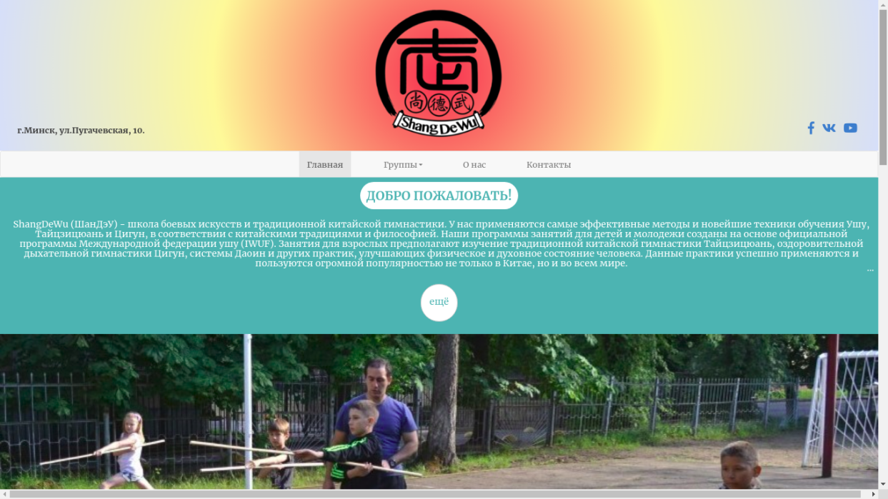

# ShangDeWu website
// TODO
- [ ] add facebook id
- [ ] dont show in production website
  - [ ] scss file
  - [ ] readme with TODO
- [ ] Update Grav.



# Features

__thridParty Libraries__
// TODO
  - [ ] make local version of the external Libraries
  * Bootstrap 3.0
  * Photo Slider
  * slick - for image carrusel
  * slickLightbox
  * jsSocials for sharing post
  * Photo Gallery

## Page BLOG
Is the list of the post order by dateformat
      * listing page
      * template blog
      * contain default.jpg

### Post structure
      * template name item
      * for custom metadata use **"partial/postmetadata"**
      * custom headers
        ```
        slug: the-slug // use ONLY latins character
        description: 'Text of description ' // recomemded 200 characters
        author: Name OF the Autor
        header_image: example.ext // image located in the folder of the post fallback to --blog/default.jpg
        subheading: 'example subheading'
        facebookimage: image-to-facebook // name of the picture and extension(example.ext) located in the post folder or a url(canonical) of external file [1200 pixels x 627 pixels ] recomemded size
        ```
      * optional add a image name **facebook_image.jpg** to be captured for facebook debugger
      * // IDEA
        - add tag for each group show in the page of the groups the post realted with this group
## page Groups
  * // TODO
    - add the structure of page leto 2019
    - add the submenu of the navegation to each group
## page leto 2019
  * // FIXME twig expression are not rendering in the shortcode section
  * // TODO
  - [ ] upload pictures througt admin in each page
  - [ ] autoplay for the galleries
  - [ ] animation for the images
  - [ ] use unpublish-date formatter
  * page: summer.md
    - config
      + process twig: true  
      + collection
        * order: default
      + using translation from template/language.yaml
         * block "SUMMER"
      + using shortcode plugin
    - headers
      + class: summer
      + description:"[#text]"
    - content:
      +  macros
        - groupLink : to fill the link to the groups in the schedule
      + section
        - extra
          + section(div)
            - inscription
              + *// TODO*
                - [ ] create the Viber group for inscription
            - training-place

  * template: summer.twig.html
### Summer groups
   - Groups:
      * children
      * adults-advanced
      * adults-beginners
    - page: summer-item.md
      * config
        - process twig: true  
      * headers
          + header_image: [name,ext]
          + program array
             ```+
             [#name]:
               name: ""
               system: ""
               creator: ""
               description: ""
               video: "#ID_YOUTUBE"
             ```
        * content
          - //TODO
            - [ ] use the youtube iframe api to more clean code(https://developers.google.com/youtube/iframe_api_reference?hl=es-419)
          + macros
            - program : to pass array program form the headers
              + > NOTE is created a frame with the  YOUTUBE sharing config and concatenated the ID_YOUTUBE
          + section


**TIP:** Check out the [general Grav installation instructions](http://learn.getgrav.org/basics/installation) for more details on this process.

---

## Existing Grav site

It is possible to install just the theme, but page content will need to reference the [Photographer theme](https://github.com/getgrav/grav-theme-photographer)'s supported templates.  It is strongly advised to at least install the Photographer Skeleton package to see the theme's capabilities in action.

To install  **just** the theme:

```
$ bin/gpm install photographer
```
